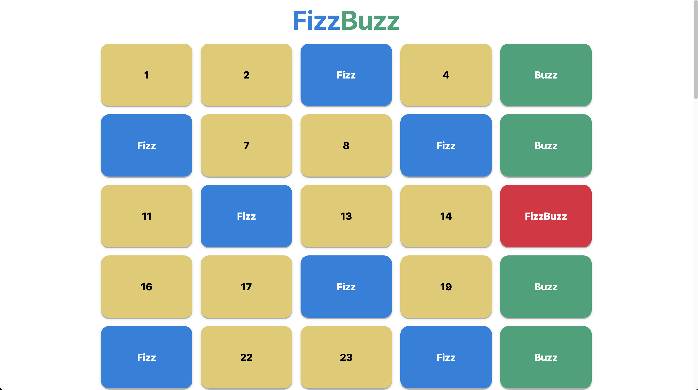

# js-fizzbuzzw

This is the classic FizzBuzz exercise built in JavaScript.

  

Given numbers from <strong>1 to 100</strong>, the program will write in the page the numbers. 
If the number is a multiple of <strong>3</strong>, instead of the number the program will write in the page <strong>Fizz</strong>, if the number is a multiple of <strong>5</strong>, instead of the number the program will write in the page <strong>Buzz</strong>, if, instead the number is a multiple of <strong>3 and 5 toghether</strong>, instead of the number, Fizz or Buzz, the program will write in the page <strong>FizzBuzz</strong>. 
 
